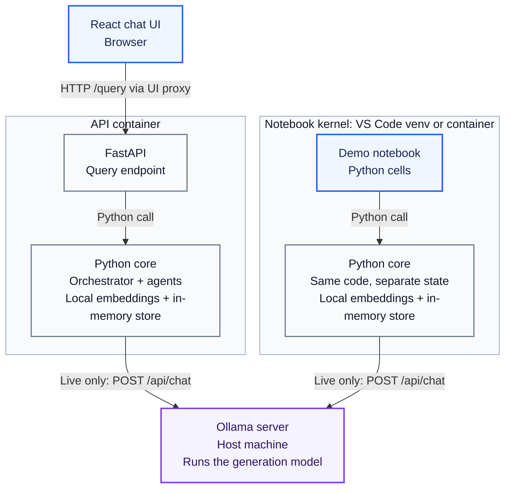
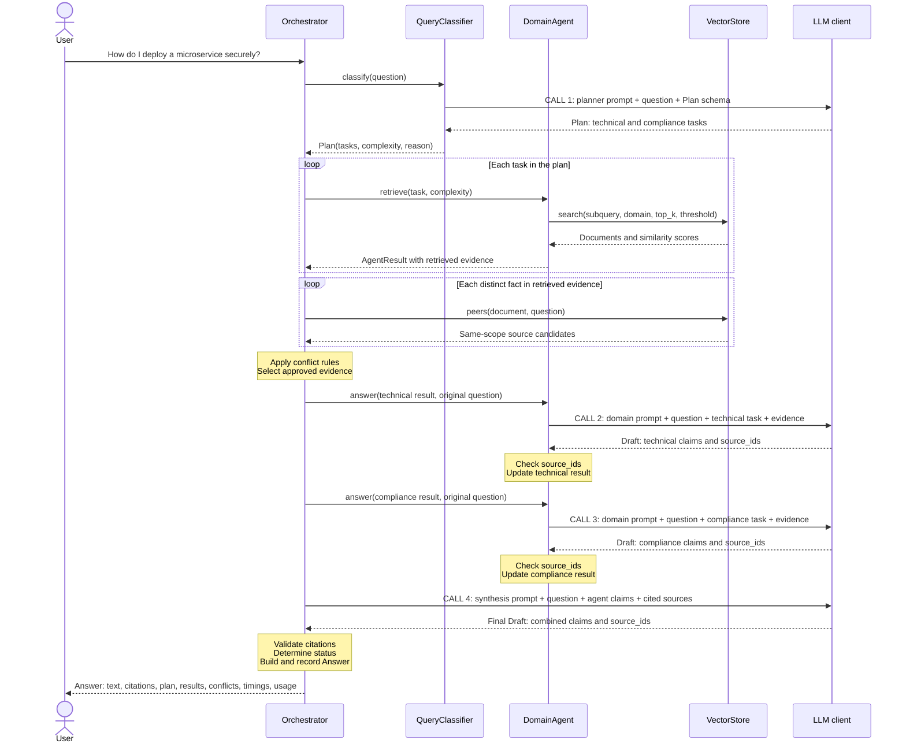

# Architecture

The application answers technical, business and compliance questions over a small
synthetic corpus. One Python core serves the notebook and API; the React UI calls
the API. Setup instructions are in the [README](../README.md).

## 1. Runtime view: interfaces, Python core and model server

Read from top to bottom. Boxes grouped inside a boundary run in the same Python
process. Arrows show calls from caller to callee; responses return along the same
connection and are omitted here. HTTP calls are explicitly labelled.

- **Interfaces:** React calls FastAPI. The main notebook examples call Python
  directly; the notebook's API check uses an in-process FastAPI test client.
- **Application core:** both paths use the same code, but each has its own
  orchestrator, agents, document vectors, feedback and history. The notebook does
  not share the running API's state.
- **Model execution:** MiniLM embeddings run inside each Python process. In mock
  mode, answer generation also stays inside that process. In Ollama mode, the LLM
  adapter calls the separate Ollama server; Qwen does not run inside the API.

[`build_system()`](../rag_system/bootstrap.py) assembles each core: it loads
`data/knowledge.json`, embeds the documents, creates the store and selected LLM
adapter, and supplies them to the orchestrator. Each document is one short passage;
the store is in memory, not a separate database service.

## 2. Interaction view: every LLM call from question to answer

Example question: **“How do I deploy a microservice securely?”** The diagram assumes
that the planner selects technical and compliance, both agents produce supported
claims, and all calls succeed. This path makes **four LLM calls**.

`LLM client` means `MockLLM` or `OllamaLLM`. In live mode, each numbered call sends
an HTTP request to Ollama and validates the returned JSON as a Pydantic object.
In mock mode, Python rules create those objects directly.

`DomainAgent` represents the selected instances of one class. They do not call
each other; the orchestrator passes context and reads their updated results.
Domain and synthesis calls also supply the `Draft` schema. Each claim contains
text and supporting source IDs. **The LLM does not produce the complete `Answer`:**
Python adds the status, request ID, trace and usage counters.

The call count depends on the path:

- With supported claims from every selected agent: one planning call, one per
  agent, and one synthesis call (3, 4 or 5 calls for 1, 2 or 3 agents).
- An agent without evidence skips generation. If no cited sources remain from
  the agents, synthesis is skipped too. Failures can also stop the flow early.
- Embeddings, retrieval, conflict resolution and citation checks are not
  generative LLM calls. Mock counts the same logical calls without contacting a model.

**Diagram conventions:** use one question and abstraction level per view, name the
boundaries, label relationships and distinguish calls from responses. These
lightweight views follow the [C4 notation guidance](https://c4model.com/diagrams/notation)
without introducing a full set of C4 diagrams. Mermaid keeps the diagrams editable
alongside the code.

## A question from input to answer

[`Orchestrator._query()`](../rag_system/orchestrator.py) makes the stages explicit:

1. **Plan:** `QueryClassifier` returns a `Plan` with up to one `Task` per domain.
   Each task contains a domain and a self-contained subquery.
2. **Retrieve:** each selected agent embeds its subquery and searches its domain.
   Normalized vectors make the dot product equivalent to cosine similarity.
   Results below the similarity threshold are excluded; the rest are ranked by
   `similarity × feedback_weight` and limited to `top_k`.
3. **Resolve conflicts:** inspect all documents with the same annotated
   `(fact_key, scope)`, including ones outside the initial retrieval. Conflicting
   values are resolved by source authority, then heuristic confidence. Close
   equal-authority conflicts are withheld. This is metadata-based conflict
   detection, not general contradiction detection over arbitrary text.
4. **Answer per domain:** each agent receives the approved evidence and returns
   claims referencing source IDs. Code checks that those references exist in the
   supplied evidence.
5. **Synthesize:** combine domain claims, validate references again, then return
   an `Answer` containing the text, citations, plan, agent results, conflicts and
   timings. Status is `answered`, `partial`, `no_evidence` or `failed`.

`top_k` is 2 for technical/business and 3 for compliance, with 2 added for a complex
plan. It limits initial retrieval, not the final citation count. These small
budgets and confidence scores are heuristics, not calibrated correctness measures.

## How agents share context

Agents communicate through the orchestrator using the Pydantic models in
[`models.py`](../rag_system/models.py); there is no message broker or direct
agent-to-agent messaging.

| Object | Purpose |
| --- | --- |
| `Plan` / `Task` | Selected domains, subqueries and retrieval complexity. |
| `Evidence` | Document snapshot, similarity, confidence and feedback weight. |
| `AgentResult` | Task, raw retrieval, approved evidence, claims, timing and error. |
| `Draft` / `Claim` | Generated statements and their supporting source IDs. |
| `Answer` | Final response and the execution trace. |

The orchestrator replaces raw retrieval with approved evidence before generation
and passes domain claims into synthesis. Source IDs such as `biz-approvals@v1#0`
identify the document, version and passage. Each short document is one passage.

## Mock and Ollama

Both adapters implement `generate(stage, instructions, payload, schema)` in
[`llm.py`](../rag_system/llm.py). Retrieval and orchestration are shared.

| Stage | Mock | Ollama |
| --- | --- | --- |
| Planning | Keyword rules and templated subqueries; multiple domains mean complex. | Model selects domains, subqueries and complexity from instructions. |
| Domain answers | Copies supplied source text into claims. | Generates claims from supplied evidence. |
| Synthesis | Deduplicates claims and keeps up to 12. | Generates a combined answer from domain claims and sources. |

`OllamaLLM` is an HTTP adapter; constructing it does not load Qwen or contact the
server. Each `generate()` calls Ollama's `/api/chat` with instructions, input and a
JSON schema, then validates the response with Pydantic. Ollama runs separately and
executes the model. Failures are reported without an automatic mock fallback.
`/health` reports application readiness and configuration, not model availability.

## State and design choices

- **In-memory NumPy store:** exact search is sufficient for the 18-document seed
  corpus; no database service is required. MiniLM embeddings are real in both
  modes. A lexical test double supports fast offline tests.
- **Controlled feedback:** one vote per retained request/source changes its
  retrieval weight by ±0.05, bounded to 0.8–1.2. This adjusts ranking, not model
  parameters. Unrelated or obsolete source versions are rejected.
- **Versioned updates:** new documents are embedded before replacing store state.
  Changed documents require a higher version; identical updates are no-ops.
- **Simple concurrency:** an `RLock` serializes queries, feedback and updates.
  Use one API worker. State resets on restart; history retains up to 256 answers.
- **Observable results:** responses expose stage timings and model call/token
  counts. `/metrics` aggregates outcomes. Citation validity and completion status
  do not establish factual correctness.

Tests cover routing, retrieval, conflicts, citations, feedback, updates and failure
handling, with opt-in MiniLM and Ollama integration tests. The notebook demonstrates
the complete flow; test commands are in the README.

The current scope is a local demo without authentication, persistence or chat
memory. A production version would need durable state, access control and broader
answer-quality evaluation before scaling concurrency or changing the vector store.
