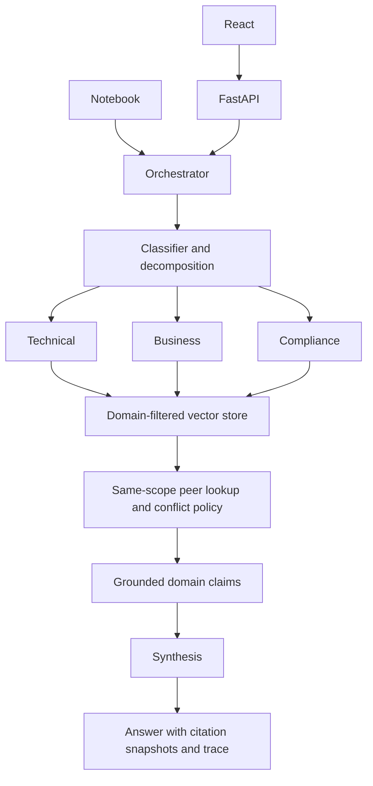

# Architecture and technical-task coverage

The objective is an understandable, testable simulation of multi-agent RAG. A single
composition root builds the same application for the notebook, API and evaluation.

## Components and messages

- `bootstrap.py`: explicit mode, embedding backend and construction; no implicit fallback.
- `models.py`: Pydantic messages with forbidden extra fields. `Plan` contains unique-domain
  `Task`s; `AgentResult` carries raw retrieved and approved evidence plus claims/errors.
- `query_classifier.py`: one structured planning call; preserves the original query in
  the payload and emits self-contained subqueries. Mock routing is explicit lexical rules.
- `vector_store.py`: independent logical knowledge bases through mandatory domain filters;
  exact normalized dot product (cosine), stable source IDs and document upserts.
- `domain_agents.py`: domain configuration, dynamic search budget and cited partial answers.
- `orchestrator.py`: bounded sequence, shared context, conflict coordination, synthesis,
  request IDs, source snapshots, feedback and metrics.
- `llm.py`: a small Responses API adapter and an extractive mock implementation.
- `api.py`: HTTP validation and status mapping only; no duplicate RAG logic.

The original question travels with each subquery. Domain agents do not exchange free-form
messages autonomously. The orchestrator shares approved evidence and partial results through
validated models. This gives bounded execution and makes agent contributions inspectable.

## Retrieval and synthesis

1. Validate input and plan the required domains.
2. For each domain, select a base budget (technical/business 2, compliance 3), adding 2
   for complex queries. Minimum cosine similarity is 0.22, or 0.25 for compliance.
   The lexical test double uses 0.08 because its score scale differs.
3. Retrieve from the agent's domain. Rank by `similarity × feedback_weight` after thresholding.
4. For each retrieved fact, fetch every same-scope peer across the corpus. This intentionally
   allows an authoritative policy from another domain to enter the approved context.
   `retrieved` and `evidence` remain separate so this is visible and retrieval recall stays honest.
5. Resolve conflicts before generation. The generator cannot silently select an excluded value.
6. Each selected agent generates supported claims, or returns empty claims when evidence is
   insufficient. Validate citation membership against its approved context.
7. Synthesize from partial claims and their sources. Validate citations again, render source
   labels in Python, and mark partial if an agent failed, had no claims, or the synthesis
   omitted all of its cited evidence.

A normal successful query uses **2 + N generation calls**. Empty evidence skips generation.
Each live call has a 30-second HTTP timeout and at most one retry for 429/5xx responses.
Timeout/refusal/incomplete/invalid-schema results are explicit failures, not fabricated answers.

## Conflict confidence and feedback

Documents are comparable only when `(fact_key, scope)` matches. Different canonical values
form a conflict. First choose the highest authority. Within that authority tier, use:

`confidence = clip(0.6 × max(cosine, 0) + 0.3 × authority + 0.1 × weight / 1.2, 0, 1)`

If a contradictory equally authoritative peer is within 0.08 confidence, withhold the fact
and expose the conflict. These constants are demonstration heuristics, not calibrated estimates.
Version numbers are comparable only within a document ID: higher versions replace that ID;
we never compare unrelated documents' version numbers to infer authority.

Feedback must refer to a current citation in a retained answer and is accepted only once per
request/source. It changes the version-specific ranking weight by ±0.05, bounded to [0.8, 1.2].
The notebook uses identical passages to isolate and demonstrate the ranking change. Updating a
document resets its source-version weight; stale feedback is rejected.

## Requirement mapping

| Assessment requirement | Implementation | Demonstration/check |
| --- | --- | --- |
| NLP query classifier | Live structured planning; explicit mock baseline | Three assignment queries; routing evaluation |
| Three domain RAG agents | Three configured `DomainAgent` instances | Domain isolation test and notebook trace |
| Orchestrator | Bounded coordinated workflow | End-to-end scenario tests |
| Vector store manager | CPU MiniLM, NumPy cosine search | Real semantic test; raw retrieval notebook cell |
| Communication protocol | Typed plan/tasks/results/claims; request IDs | Pydantic and citation contract tests |
| Query decomposition | Domain-specific subqueries plus original constraints | Printed plan in notebook |
| Dynamic retrieval | Domain and complexity select budgets/thresholds | Retrieval budget test |
| Synthesis | Structured claims from approved partial results | Omitted-domain and invalid-citation checks |
| Basic learning | Simulated bounded source weights | Before/after ranking experiment |
| Conflict resolution | Authority, confidence and unresolved state | 90 vs 30 days; equal-authority ambiguity |
| Citation tracking | `id@version#chunk` plus copied passages | Historical snapshot and stale-source tests |
| Knowledge updates | Atomic upsert, version validation, embedding replacement | 30 → 14 day policy update |
| Performance monitoring | Per-stage timing, per-agent errors, explicit rates | Notebook metrics and `/metrics` |
| Error handling | Invalid input, failed provider, partial domain, absent evidence | Contract tests and notebook failure injection |
| Documentation | README, architecture, validation, notebook | Reproducible commands and stated limitations |

## Boundaries

No database, durable memory, queues or agent framework is needed for this small corpus.
State is process-local and locked. Semantic citations are not automatically proven: source
membership cannot detect an unsupported paraphrase or a model misreading an exception.
User/document text is described as untrusted in prompts, but prompts are not a complete
prompt-injection defence. There are no agent tools or external write actions.

The dependency choices prioritize a CPU demo and easy interview explanation. FastEmbed is
used instead of PyTorch-based Sentence Transformers for the same MiniLM embedding concept.
NumPy is sufficient at this scale. API/UI layers can change independently of the core.
