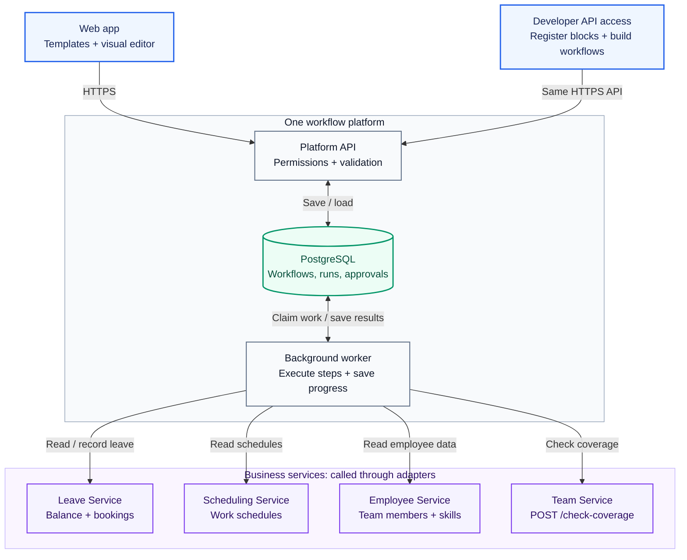
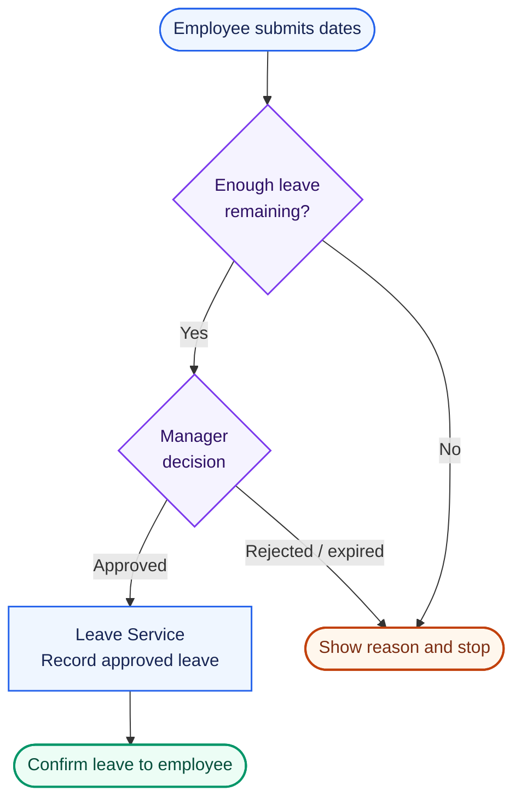
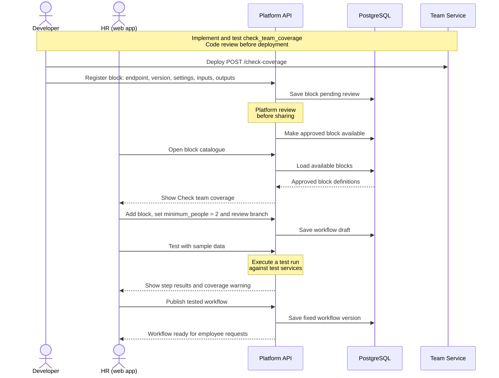
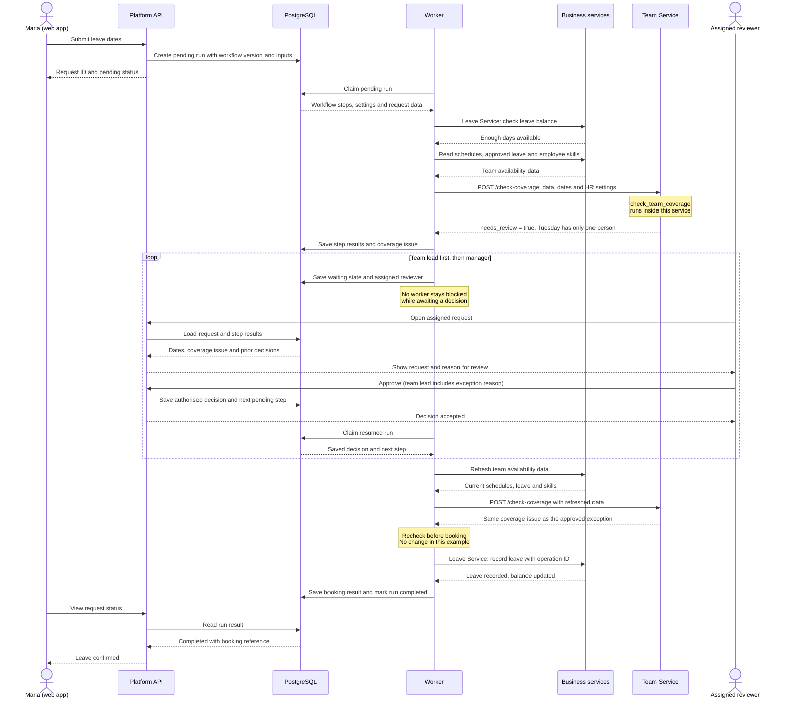

# The Self-Service Paradox

For this task, I use a **leave-request system** to show how business users and
developers can build workflows on one platform.

HR builds the process visually; a developer adds a team-coverage check through
an API. Both work on the same workflow. This is a design proposal, assuming
company login, existing business services and a way to deploy changes to them.

## 1. Architecture Design

Start with a web app, a Python API, a background worker and PostgreSQL. The API
saves workflows and starts runs. The worker executes steps and saves their
results, so work can continue after the user closes the browser.

Read top to bottom: both interfaces use the platform API, PostgreSQL stores
progress, and the worker calls business services over HTTPS.

The **worker manages the workflow**; **services execute business operations**.
For example, Team Service runs `check_team_coverage` and returns its result through
`POST /check-coverage`. Small backend adapters make these API calls and read the
responses, which return along the same connections shown above.

This lets us add logic to existing services without building a custom code runner;
the cost is handling network failures and keeping API versions compatible.

The editor and direct API calls save the same workflow format: steps, settings,
connections and block versions. A block hides the service's implementation, so
HR can edit the surrounding workflow without dealing with its code.

**Progressive disclosure** means showing more detail only when needed: start with
a template and guided form, then offer the step editor and advanced block
settings. Developers can also use the API directly.

Initially support forms, conditions, service calls and approvals. Keep the API
and worker in one codebase to make changes easier. Loops and parallel branches
can wait until there is a concrete need.

## 2. User Experience Strategy

Use one workspace: **Build, Test, Publish, View runs**.

### Business user: build a standard leave process

HR selects a template. A short wizard asks which fields employees must fill in
and who approves requests. HR can then drag and drop steps, test with sample data
and publish.

### Power user: add a team-coverage rule

HR needs at least **two people available each day, including one who can handle
urgent support requests**. Maria requests a week off, but another colleague is
already away on Tuesday. Without Maria, only one person remains. Her leave
balance alone cannot reveal this problem.

The developer implements and tests `POST /check-coverage` in Team Service,
then deploys it after code review and registers it as a platform block.
HR adds the approved block, sets the minimum to two people and selects the
required skill; coverage problems go to a team lead for an exception decision.

### From new capability to published workflow

Setup happens before employees submit requests: the developer releases a service
update, then HR uses its block through the web app. Solid arrows show actions or
requests; dashed arrows show responses.

Switching views preserves the workflow: HR edits block settings, while developers
can inspect API details or create workflows directly through the platform API.
Service code stays in the service's repository; the platform stores block definitions.

For onboarding, provide a working template for HR and an example API integration
for developers. Tests use sample data without changing real records. Show errors
on the affected step, and support keyboard controls alongside drag-and-drop.

## 3. Technical Implementation

### What we need to build

Build the workflow platform and add the coverage endpoint to Team Service;
reuse the company's login, Leave, Scheduling and Employee APIs.

| Component | What to implement |
| --- | --- |
| Web app | A template wizard, drag-and-drop step editor, block settings, test results, request form and approval screen. |
| Platform API | Save drafts, validate and publish workflows, start runs, accept authorised approvals and return progress. |
| Block catalogue | Let developers register an approved endpoint with settings and input/output definitions, then show reviewed blocks in the editor. |
| Background worker | Read pending steps from PostgreSQL, call service APIs, check responses, choose the next step and save progress. |
| Team Service extension | Implement and test `POST /check-coverage`, returning `needs_review` and reasons from team data, requested dates and staffing settings. |

The catalogue belongs to the platform API; the coverage calculation belongs to
Team Service. The worker only calls that service and uses its result.

### What we store

| Record | Data |
| --- | --- |
| Workflow | Owner, draft and published versions of steps, settings and connections. |
| Block | Name, owner, version, review status, settings, inputs, outputs and service operation. |
| Run | One submitted request: workflow version, employee inputs, current step, results, status and errors. |
| Approval | Request, step, reviewer, deadline, decision and reason. |

Each run keeps its published workflow version, so later edits cannot change an
active request; changes and decisions record who made them.

### From Maria's request to recorded leave

Maria has enough leave days, but Tuesday needs a staffing exception. This example
shows the team lead and manager approving, followed by an unchanged coverage
recheck and a successful booking.

“Business services” groups the Leave, Scheduling and Employee APIs; user and
reviewer actions pass through the web app.

The diagram groups routine database writes and repeats two fixed approval steps;
the worker saves progress after each step and releases the run while waiting.

### Basic execution rules

- **Approvals:** only the assigned reviewer can decide once, and rejection or expiry stops the request.
- **Recovery:** save the step result and next step together, and let a worker reclaim unfinished work after a crash.
- **Service calls:** use approved endpoints, response validation, timeouts and limited retries, with credentials stored outside workflow data.
- **Duplicate writes:** reuse an operation ID when the service supports it; otherwise stop uncertain writes for manual checking.
- **Changing availability:** recheck before booking and ask for new approval if the result changes; concurrent bookings still need manual coordination until services support a shared reservation mechanism.

## 4. Long-term Maintainability

- **Ownership:** the platform team maintains execution and permissions, HR owns the workflow, and service teams maintain their APIs and blocks.
- **New capabilities:** add a service endpoint and register a reviewed block so other teams can reuse it.
- **Safe updates:** keep working versions available while owners test upgrades, and give migration instructions before retiring an old version.
- **Community:** keep examples and owner contacts in the catalogue, with one shared place to request blocks and report problems.
- **Growth:** monitor failures and waiting time, then add workers when needed while respecting service limits.
- **Delivery:** build the standard leave flow first, add coverage next, and test approvals, recovery and duplicate submissions before wider rollout.
